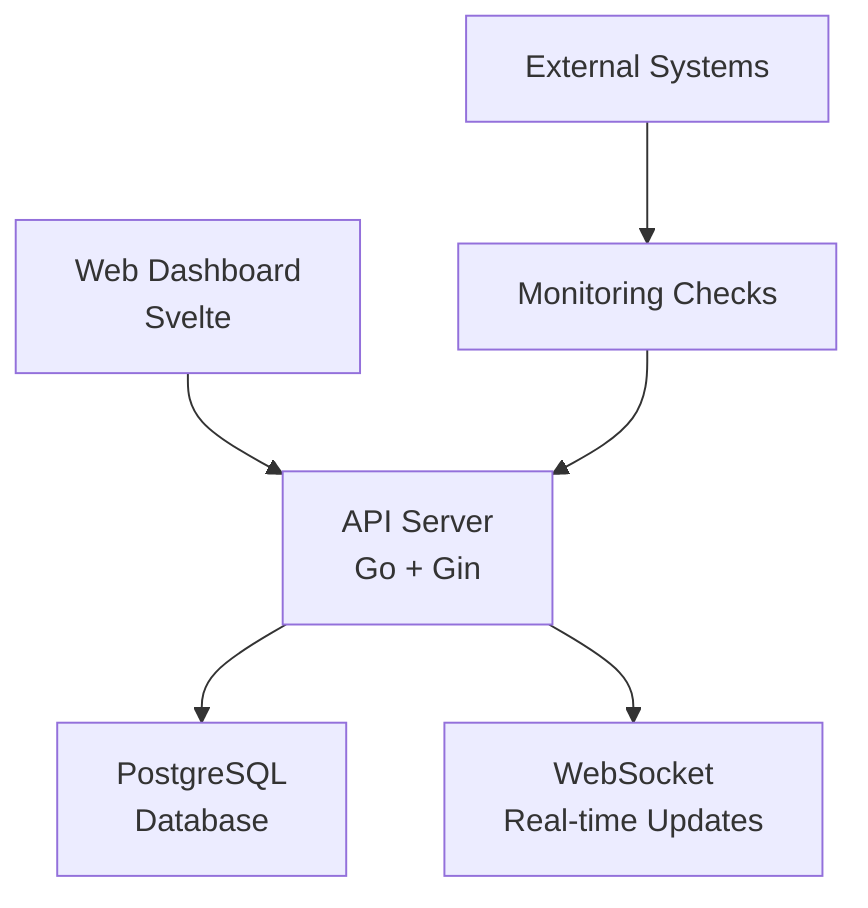

# Welcome to Moogie

**Moogie** is a comprehensive infrastructure monitoring platform designed to help you keep track of your services, APIs, and infrastructure health with ease.

## What is Moogie?

Moogie provides:

- 🔍 **Multi-Protocol Monitoring** - Support for HTTP/HTTPS, DNS, SSL certificate, and connectivity checks
- 📊 **Real-time Dashboard** - Beautiful, responsive interface to visualize your infrastructure health
- 🔄 **WebSocket Updates** - Live updates without page refreshes
- 📈 **Historical Data** - Track performance trends and success rates over time
- 🐳 **Docker Ready** - Full containerization with Docker Compose
- 🚀 **Production Ready** - Built with Go and PostgreSQL for reliability and performance

## Architecture Overview



Moogie consists of three main components:

1. **Web Dashboard** - A modern Svelte-based frontend for visualizing monitoring data
2. **API Server** - A robust Go backend with REST APIs and WebSocket support
3. **Database** - PostgreSQL for reliable data storage with migrations

## Quick Start

Get Moogie running in minutes with Docker Compose:

```bash
git clone https://github.com/ItsKarma/moogie.git
cd moogie
docker compose up --build
```

Then access:

- 🖥️ **Dashboard**: http://localhost:3000
- 🔌 **API**: http://localhost:8080
- 📚 **Documentation**: http://localhost:3000

## Key Features

### Monitoring Types

- **API Health Checks** - Monitor REST API endpoints
- **SSL Certificate Monitoring** - Track certificate expiration
- **DNS Resolution Checks** - Verify DNS functionality
- **Ping Connectivity** - Basic network connectivity tests
- **Custom Checks** - Extensible configuration system

### Dashboard Features

- **Real-time Metrics** - Live success rates and response times
- **Historical Analysis** - Date range filtering and trend analysis
- **Job Management** - Configure and monitor multiple check types
- **Status Overview** - At-a-glance health indicators

### API Capabilities

- **RESTful Endpoints** - Full CRUD operations for jobs and executions
- **WebSocket Support** - Real-time updates for live monitoring
- **Date Range Filtering** - Flexible querying with time ranges
- **Comprehensive Logging** - Detailed execution history and results

## Next Steps

Ready to get started? Check out our guides:

- [Docker Setup](./getting-started/docker-setup) - Container deployment guide
- [API Reference](./api/overview) - Complete API documentation

## Support

Need help? We're here for you:

- 📖 **Documentation** - Comprehensive guides and references
- 🐛 **Issues** - [GitHub Issues](https://github.com/ItsKarma/moogie/issues)
- 💬 **Discussions** - [GitHub Discussions](https://github.com/ItsKarma/moogie/discussions)
- 📧 **Contact** - Reach out via GitHub

---

Let's start monitoring! 🚀
